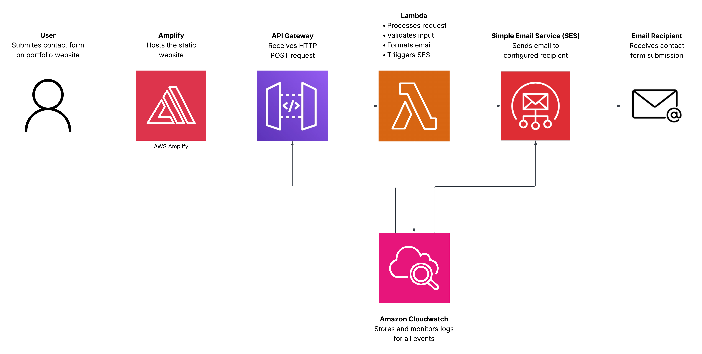

# AWS Serverless Contact Form

A fully serverless contact form built on AWS, originally created as a practical first project to learn core AWS services. It processes form submissions and delivers email notifications via Amazon SES, with no server management required. The form is live and used as a real contact channel linked from my LinkedIn profile.

## Live Demo

https://staging.d2vpf59fscl1pp.amplifyapp.com/

## Architecture

## Overview

This project implements a fully serverless contact form system without requiring any server management.

## AWS Services Used

- AWS Amplify – Frontend hosting with automatic CI/CD on push
- Amazon API Gateway – Public-facing REST API endpoint with throttling
- AWS Lambda – Backend validation and request processing (Python)
- Amazon SES – Email delivery service
- Amazon CloudWatch – Logging and post-execution diagnostics

## Request Flow

When a user submits the form:

1. The frontend sends a POST request to API Gateway
2. API Gateway applies burst rate limits before passing the request to Lambda
3. Lambda validates the submitted fields in Python, rejecting malformed or incomplete submissions early
4. Lambda passes the validated data to SES
5. SES delivers the email to the verified recipient address
6. CloudWatch logs execution details, errors, and performance metrics

## Design Decisions

- Amazon SES for email delivery — chosen as the native AWS email service to keep the stack consistent and gain hands-on experience with a new service, rather than using a third-party provider like SendGrid or Formspree
- Lambda validation before SES — input is validated in Python before any SES call is made, which prevents malformed submissions from reaching the email pipeline and makes error handling more predictable
- API Gateway throttling — burst rate limits are configured at the API Gateway level to provide a basic layer of protection against spam and request floods without adding infrastructure complexity
- CloudWatch for observability — provides passive logging of Lambda executions and errors. Most useful for diagnosing issues after they occur rather than preventing them in real time
- AWS Amplify for hosting — automatic redeployment on every GitHub push removes manual deployment steps, keeping the workflow simple during active development

## Key Learnings

- Amazon SES has strict sending restrictions by default — SES launches in sandbox mode, which only permits sending to verified email addresses. Understanding this early is essential, as emails silently fail to arrive until recipient addresses are verified or sandbox restrictions are lifted
- CloudWatch is passive by design — it stores logs and metrics but does not act on them. For a small project it functions more like a surveillance camera than a security gate — valuable for diagnosing errors after the fact, but not a substitute for active controls like API Gateway throttling
- Throttling belongs at the edge, not in application code — configuring burst rate limits directly on API Gateway means abusive or malformed requests are rejected before they ever reach Lambda, which is both more efficient and easier to maintain
- Early validation reduces downstream errors — rejecting incomplete or malformed submissions in Lambda before passing data to SES meant fewer unexpected SES errors and cleaner logs, making debugging significantly easier during development

### What I Would Do Next

- Add spam protection such as a honeypot field or invisible CAPTCHA to filter bot submissions without adding friction for real users
- Explore moving out of SES sandbox mode to support arbitrary recipient addresses
- Set up CloudWatch alarms to alert on elevated error rates, making monitoring active rather than passive

## Contact

Open to internship and graduate opportunities in software engineering and cloud computing.

- Email: nevenspooner03@gmail.com
- LinkedIn: https://www.linkedin.com/in/neven-spooner/
